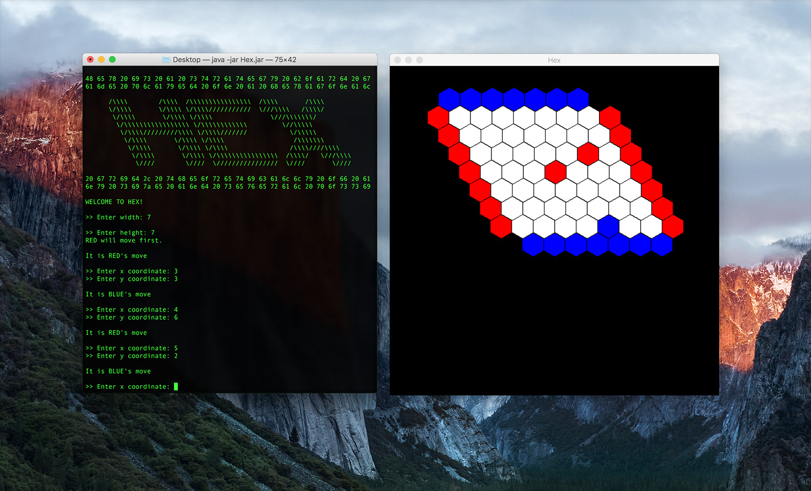

# Hex Game

End of year university project based board game Hex - Work in progress

## What is Hex?

Hex is a two player strategy game invented by Piet Hein and John Nash and played on a hexagonal grid. The board is rhombic and can be any dimension, though typically games are played on 11x11 boards.

Players are assigned a colour and take turns to place one of their pieces on a cell. The goal for each player is to connect the two sides of the board marked by their color before their opponent does so. The game cannot end in a draw and though there is no know winning strategy, it has been proven one exists. The first player has a distinct advantage so this implimentation picks the first player randomly.

## The aim

The aim of the assignment was to write a Java implimentation of the game allowing humans to play against humans, humans to play against a computer and computers to play against computers (though only human vs. human works currently). A set of interfaces was provided to develop code against.

The following assessment areas were outlined:
* Bullet list
* Bullet list
* Bullet list

## Screenshot


## How to run

Execute from the command line with the following command
```
java -jar Hex.jar
```
